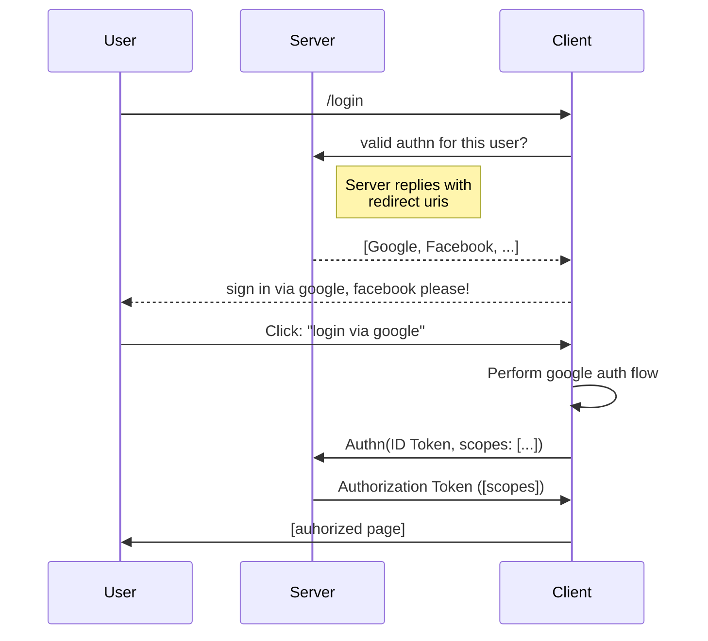

# Login
Clearly, we can't have a web system without a login!

I really hate managing sessions, and I think they're kind of an outdated concept, same with usernames and passwords.

"Sessions" are actually instead authorization credentials, and the process of login is the process of getting an authorization credential for an authentication credential.

This authorization token is then essentially the session.